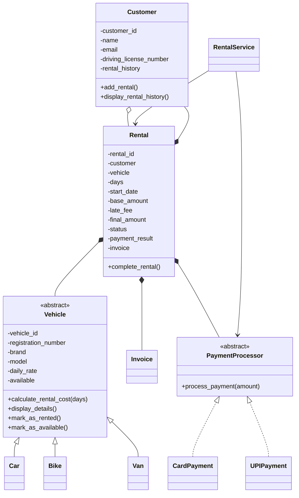

# Vehicle Rental Management System

A console-based Python OOP case study for managing cars, bikes and vans. The project implements the assignment's rental workflow, business rules, payment abstraction, exception handling and JSON persistence.

## Main features

- Abstract `Vehicle` with `Car`, `Bike` and `Van` specializations.
- Customer registration and rental history.
- Vehicle search by ID, type and daily-price range.
- Payment abstraction through `PaymentProcessor`, with Card and UPI implementations.
- Rental confirmation only after successful payment.
- Vehicle availability locking and release after return.
- Late-fee calculation: `late days × 20% × vehicle daily rate`.
- Final invoice generation.
- Persistent JSON data in `data/customers.json`, `data/vehicles.json` and `data/rents.json`.
- Interactive terminal menu plus a dedicated mandatory-assignment demo.
- Automated success and failure tests using Python's standard `unittest` module.

## OOP evidence

| Concept | Evidence |
|---|---|
| Classes / objects | `Vehicle`, `Customer`, `Rental`, `Invoice`, payment classes |
| Encapsulation | Domain fields use private `__...` attributes with properties |
| Abstraction | Abstract `Vehicle` and `PaymentProcessor` |
| Inheritance | `Car`, `Bike`, `Van` inherit from `Vehicle` |
| Polymorphism | `calculate_rental_cost()` is overridden by each vehicle type |
| Interface / contract | `PaymentProcessor.process_payment()` |
| Method overriding | Vehicle subclasses implement type-specific pricing |
| Method overloading equivalent | `RentalService.search()` accepts optional combinations of filters; Python does not provide Java-style compile-time overloading |
| Composition | `Rental` contains a `Customer`, `Vehicle`, payment result and `Invoice` |
| Exception handling | Validation, unavailable vehicle, invalid dates, rental state and payment failures |

## Class diagram



## Run

From the `CapstoneProj` directory:

```bash
python main.py
```

Choose an option from the menu. Option `9` runs the assignment's mandatory demonstration scenario.

For automated tests:

```bash
python -m unittest discover -s tests -v
```

Current test result: **6 tests passed**. A captured mandatory-demo run is included in [`demo_output.txt`](demo_output.txt).

## Mandatory demo

The demo creates/ensures one car, one bike and one van, registers two customers, rents the demo car for three days, attempts a second simultaneous rental, returns the car one day late, shows the base amount, late fee and final amount, confirms availability, and prints Customer A's rental history.

For the sample values used by the demo:

- Car rate: Rs. 2,000/day
- 3-day base rental: Rs. 6,000
- One late day: Rs. 400 late fee
- Final amount: Rs. 6,400

The demo records are persisted in the same JSON files as normal application activity.

## Data safety

Payment data persists only transaction metadata such as method, transaction ID, amount and status. Card numbers, CVV and other sensitive payment credentials are never stored.

## Assignment coverage

The implementation is aligned with the supplied OOP case-study requirements: console application, vehicle-specific pricing, customer history, payment-before-confirmation, return/late-fee workflow, interface-based payment processing, encapsulation, inheritance, polymorphism, composition, exception handling, persistence and the mandatory demonstration scenario.
