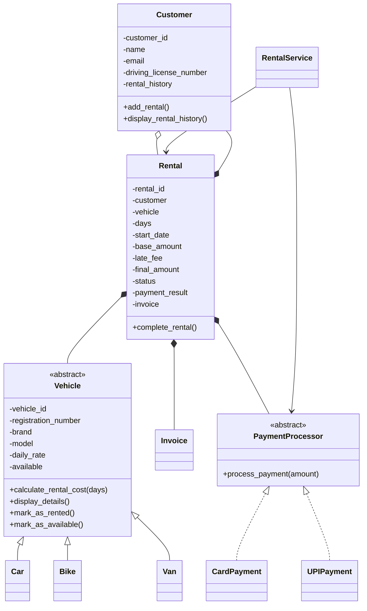

# Vehicle Rental Management System

A console-based Vehicle Rental Management System developed in Python using Object-Oriented Programming (OOP) principles.

## Streamlit application

Run the simple booking interface with:

```bash
pip install -r requirements.txt
streamlit run streamlit_app.py
```

The app is called **Rent Your Ride** and includes vehicle search, customer registration, booking, payments, returns with invoices, rental history, rental records, and vehicle management.

This project was built as part of the OOP Case Study Assignment and demonstrates abstraction, encapsulation, inheritance, polymorphism, interfaces, composition, exception handling, and file-based persistence.

---

# Features

## Vehicle Management

- Add and manage Cars, Bikes, and Vans.
- View all available vehicles.
- Search vehicles by:
  - Vehicle ID
  - Vehicle Type
  - Price Range
- Track vehicle availability.

## Customer Management

- Register new customers.
- Store:
  - Customer ID
  - Name
  - Email
  - Driving Licence Number
- View customer rental history.

## Rental Workflow

- Display available vehicles.
- Select vehicle and rental duration.
- Validate rental requests.
- Process payment before confirmation.
- Generate rental records.
- Generate invoices automatically.

## Vehicle Return

- Return rented vehicles.
- Detect late returns.
- Calculate late fees.
- Update vehicle availability.
- Update customer rental history.

## Payment Processing

Supports multiple payment methods:

- Card Payment
- UPI Payment

The system uses a PaymentProcessor abstraction, allowing new payment methods to be added without modifying existing code.

## Data Persistence

All data is stored in JSON files:

```text
data/
├── customers.json
├── vehicles.json
└── rents.json
```

Data remains available between application runs.

---

# OOP Concepts Demonstrated

## Encapsulation

Private attributes with validation through properties and methods.

## Abstraction

Abstract base classes:

- Vehicle
- PaymentProcessor

## Inheritance

```text
Vehicle
│
├── Car
├── Bike
└── Van
```

## Polymorphism

Each vehicle type implements its own rental cost calculation:

- Car → Standard calculation
- Bike → 5% discount for rentals longer than 5 days
- Van → Additional service charge

## Composition

Rental contains:

- Customer
- Vehicle
- Payment
- Invoice

## Interface / Contract

PaymentProcessor defines:

```python
process_payment(amount)
```

Implemented by:

- CardPayment
- UPIPayment

## Exception Handling

Handles:

- Invalid rental days
- Vehicle unavailable
- Invalid customer ID
- Invalid payment method
- Payment failures

---

# Project Structure

```text
CapstoneProj/
│
├── main.py
├── README.md
├── CLASS_DIAGRAM.md
├── demo_output.txt
│
├── data/
│   ├── customers.json
│   ├── vehicles.json
│   └── rents.json
│
├── schemas/
│   ├── vehicle.py
│   ├── customer.py
│   ├── rental.py
│   ├── invoice.py
│   └── payment.py
│
├── services/
│   ├── rental_service.py
│   ├── customer_service.py
│   └── vehicle_service.py
│
└── tests/
    └── test_system.py
```

---

# Business Rules

- Rental days must be greater than zero.
- Customers cannot rent unavailable vehicles.
- The same vehicle cannot be rented by multiple customers simultaneously.
- Every vehicle must have a valid registration number.
- Payment must complete before rental confirmation.
- Sensitive payment information is not stored.
- Returned vehicles become available again.
- Invalid operations display meaningful error messages.

---

# Rental Cost Rules

## Car

```text
Rental Cost = Daily Rate × Rental Days
```

## Bike

```text
Rental Cost = Daily Rate × Rental Days

If rental days > 5:
    5% discount applied
```

## Van

```text
Rental Cost = Daily Rate × Rental Days
            + Service Charge
```

---

# Late Fee Calculation

```text
Late Fee =
Late Days × (20% × Daily Rental Rate)
```

---

# Mandatory Demonstration Scenario

The application includes a built-in demonstration scenario that performs:

1. Add one Car, Bike, and Van.
2. Register two customers.
3. Display available vehicles.
4. Rent a Car for 3 days.
5. Attempt duplicate rental.
6. Show Vehicle Unavailable message.
7. Process payment.
8. Return vehicle one day late.
9. Calculate late fee.
10. Generate final invoice.
11. Mark vehicle available again.
12. Display rental history.

---

# Running the Application

## Clone Repository

```bash
git clone <repository-url>
cd CapstoneProj
```

## Run Application

```bash
python main.py
```

---

# Running Tests

```bash
python -m unittest discover tests
```

---

# Sample Menu

```text
1. Add Vehicle
2. Register Customer
3. View Available Vehicles
4. Search Vehicles
5. Rent Vehicle
6. Return Vehicle
7. View Rental History
8. View Stored Data
9. Run Assignment Demo
0. Exit
```

---

# Why Polymorphism Was Used

The system avoids large if-else blocks when calculating rental costs.

Each vehicle type overrides:

```python
calculate_rental_cost(days)
```

This allows the Rental Service to call the same method for every vehicle while the correct implementation is selected automatically at runtime.

Benefits:

- Cleaner code
- Easier maintenance
- Easy addition of new vehicle types
- Better scalability

---

# Author

Sudip Das

OOP Capstone Project – Vehicle Rental Management Syst

# Vehicle Rental Management System

A console-based Python OOP case study for managing cars, bikes and vans. The project implements the assignment's rental workflow, business rules, payment abstraction, exception handling and JSON persistence.

## Main features

- Abstract `Vehicle` with `Car`, `Bike` and `Van` specializations.
- Customer registration and rental history.
- Vehicle search by ID, type and daily-price range.
- Payment abstraction through `PaymentProcessor`, with Card and UPI implementations.
- Rental confirmation only after successful payment.
- Vehicle availability locking and release after return.
- Late-fee calculation: `late days × 20% × vehicle daily rate`.
- Final invoice generation.
- Persistent JSON data in `data/customers.json`, `data/vehicles.json` and `data/rents.json`.
- Interactive terminal menu plus a dedicated mandatory-assignment demo.
- Automated success and failure tests using Python's standard `unittest` module.

## OOP evidence

| Concept                       | Evidence                                                                                                                         |
| ----------------------------- | -------------------------------------------------------------------------------------------------------------------------------- |
| Classes / objects             | `Vehicle`, `Customer`, `Rental`, `Invoice`, payment classes                                                              |
| Encapsulation                 | Domain fields use private`__...` attributes with properties                                                                    |
| Abstraction                   | Abstract`Vehicle` and `PaymentProcessor`                                                                                     |
| Inheritance                   | `Car`, `Bike`, `Van` inherit from `Vehicle`                                                                              |
| Polymorphism                  | `calculate_rental_cost()` is overridden by each vehicle type                                                                   |
| Interface / contract          | `PaymentProcessor.process_payment()`                                                                                           |
| Method overriding             | Vehicle subclasses implement type-specific pricing                                                                               |
| Method overloading equivalent | `RentalService.search()` accepts optional combinations of filters; Python does not provide Java-style compile-time overloading |
| Composition                   | `Rental` contains a `Customer`, `Vehicle`, payment result and `Invoice`                                                  |
| Exception handling            | Validation, unavailable vehicle, invalid dates, rental state and payment failures                                                |

## Class diagram



## Run

From the `CapstoneProj` directory:

```bash
python main.py
```

Choose an option from the menu. Option `9` runs the assignment's mandatory demonstration scenario.

For automated tests:

```bash
python -m unittest discover -s tests -v
```

Current test result: **6 tests passed**. A captured mandatory-demo run is included in [`demo_output.txt`](demo_output.txt).

## Mandatory demo

The demo creates/ensures one car, one bike and one van, registers two customers, rents the demo car for three days, attempts a second simultaneous rental, returns the car one day late, shows the base amount, late fee and final amount, confirms availability, and prints Customer A's rental history.

For the sample values used by the demo:

- Car rate: Rs. 2,000/day
- 3-day base rental: Rs. 6,000
- One late day: Rs. 400 late fee
- Final amount: Rs. 6,400

The demo records are persisted in the same JSON files as normal application activity.

## Data safety

Payment data persists only transaction metadata such as method, transaction ID, amount and status. Card numbers, CVV and other sensitive payment credentials are never stored.

## Assignment coverage

The implementation is aligned with the supplied OOP case-study requirements: console application, vehicle-specific pricing, customer history, payment-before-confirmation, return/late-fee workflow, interface-based payment processing, encapsulation, inheritance, polymorphism, composition, exception handling, persistence and the mandatory demonstration scenario.
